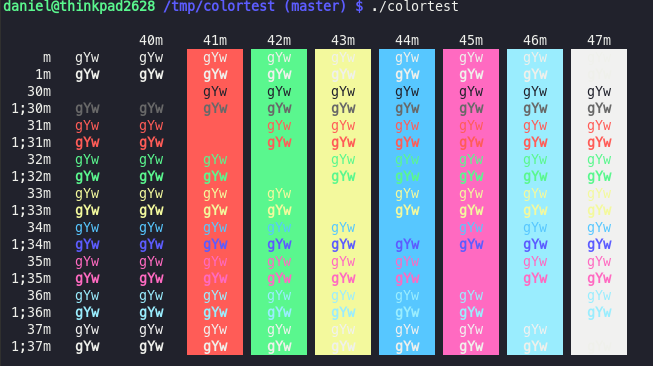

# st-snazzy

> Elegant st theme with bright colors. Based on [alacritty-snazzy](https://github.com/alebelcor/alacritty-snazzy).



## Install
1. Clone st from suckless.
```sh
$ git clone git://git.suckless.org/st
```
2. Apply patch.
Copy st-snazzy.patch into st source folder, and run the following command.
```sh
$ cp st-snazzy.patch /where/you/have/st/source
$ cd /where/you/have/st/source
$ git apply st-snazzy.patch
```
3. Compile and/or install.
Here is how to then compile and install st from source, just remember to have all the dependencies.
```
$ make
$ make install clean
```
4. Done!
You are now done!

## License
MIT © [Daniel Florescu](190405.xyz)
